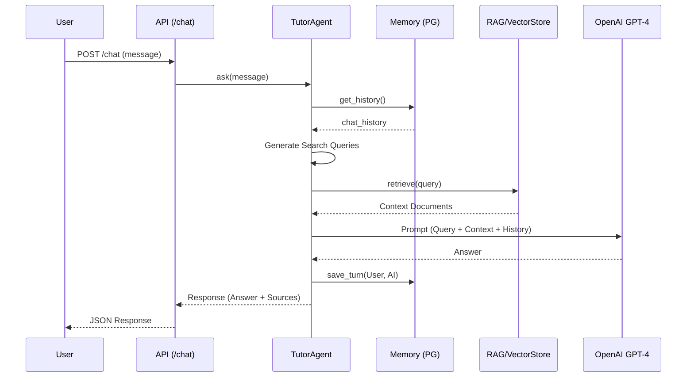
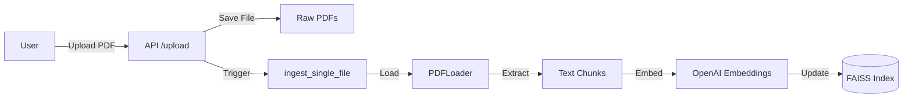

# AI Tutor - Backend Architecture Overview

This document provides a comprehensive overview of the backend codebase for the AI Tutor application. The backend is designed with a modular architecture using **FastAPI** for the web layer, **LangChain** for AI orchestration, and **PostgreSQL/Supabase** for persistent memory.

## 1. API Layer (`src/api/`)
The entry point for all client interactions.

- **`src/api/server.py`**
    - **Description**: The main FastAPI application file.
    - **Key Features**:
        - **`POST /chat`**: The core endpoint. Handles user queries, routes them to the `TutorAgent`, and returns AI responses with citations. Includes fallback logic to "document-only" search if AI quotas are exceeded.
        - **`POST /upload`**: Handles PDF file uploads. Triggers the incremental ingestion process (`ingest_single_file`) to update the knowledge base immediately.
        - **`GET /health`**: Health check endpoint to verify the agent's status.

## 2. AI Agent Core (`src/agent/`)
The "Brain" of the application that orchestrates logic, memory, and retrieval.

- **`src/agent/tutor.py`**
    - **Description**: Contains the `TutorAgent` class.
    - **Key Features**:
        - Initializes the LLM (`gpt-4o-mini`).
        - Manages conversation flow: `User Input` -> `History Retrieval` -> `Question Expansion` -> `RAG Search` -> `Response Generation`.
        - **`search_documents()`**: A fallback method for pure IDR (Information Retrieval) without generation.

- **`src/agent/tools/tool_factory.py`**
    - **Description**: Follows the Factory Pattern to create "Tools" for the agent.
    - **Key Features**:
        - **`create_tools()`**: Packages the RAG retrieval logic into a standard LangChain `Tool` format (`search_course_materials`) that the agent can invoke.

## 3. RAG Retrieval System (`src/rag/`)
Manages the Long-Term Knowledge Base (Vector Database).

- **`src/rag/vector_store.py`**
    - **Description**: Manages `FAISS` vector indexes and `OpenAIEmbeddings`.
    - **Key Features**:
        - **`create_index()`**: Builds the initial vector database from all PDF documents.
        - **`add_documents()`**: Handles **incremental updates**, allowing new files to be added to the index without a full rebuild.
        - **`get_retriever()`**: Provides the search interface used by the Agent to find relevant document chunks.

## 4. Data Loaders (`src/loaders/`)
Responsible for parsing raw files into machine-readable text.

- **`src/loaders/pdf_loader.py`**
    - **Description**: Uses `PyMuPDFLoader` to extract text and metadata from PDF files.
    - **Key Features**:
        - **`load_documents()`**: Scans `data/raw_pdfs/` for batch processing.
        - **`load_single_file()`**: Optimized loader for processing individual uploads on the fly.

## 5. Memory Management (`src/memory/`)
Handles Short-Term Memory (Conversation History).

- **`src/memory/postgres_manager.py`**
    - **Description**: Concrete implementation of persistent storage using **PostgreSQL (Supabase)**.
    - **Key Features**: Uses `PostgresChatMessageHistory` to store/retrieve chat sessions, ensuring conversations survive server restarts.

- **`src/memory/memory_manager.py`**
    - **Description**: Defines the abstract base class (`BaseMemoryManager`) and interfaces.
    - **Key Features**: implementations (InMemory vs Postgres) to be swapped easily (Dependency Inversion Principle).

## 6. Ingestion & Entry Points (`src/`)
Scripts to manage data processing and application startup.

- **`src/ingest.py`**
    - **Description**: Scripts for building the knowledge base.
    - **Key Features**:
        - `ingest_data()`: Full system reset and rebuild of the vector index.
        - `ingest_single_file()`: Lightweight function called by the API for single file updates.

- **`src/config/settings.py`**
    - **Description**: Central configuration management.
    - **Key Features**: Loads environment variables (`OPENAI_API_KEY`, `DATABASE_URL`) from `.env` and defines absolute paths for data directories.

## 7. Testing & Maintenance (`tests/` & Root)
Quality assurance and comprehensive debugging tools.

- **`tests/` Directory**
    - **`test_history.py`**: Verifies database persistence of chat history.
    - **`test_vector_store.py`**: Validates embedding creation and similarity search.
    - **`test_pdf_loader.py`**: Checks PDF text extraction accuracy.
    - **`test_memory_manager.py`**: Unit tests for the memory abstraction layer.
    - **`test_tool_factory.py`**: Verifies the agent tool creation logic.
    - **`test_main.py`**: Basic module loading test.
    - **`debug_auth.py`** / **`debug_db.py`**: Isolated scripts for troubleshoot connection issues.

- **Root Utility Scripts**
    - **`fix_env.py`**: Helper to programmatically update `.env` variables (e.g., specific DB connection strings).
    - **`test_key.py`**: "Smoke test" script to verify OpenAI API key validity before starting the main app.

## 8. Miscellaneous & Documentation
Other relevant files for understanding the backend environment.

- **`src/main.py`**
    - **Description**: A minimal entry point script. Currently serves as a placeholder to confirm the module can load, but `src/api/server.py` is the actual application runner.

- **`requirements.txt`**
    - **Description**: Lists all Python dependencies required to run the backend (e.g., `fastapi`, `langchain`, `openai`, `psycopg2`).

- **`SOLID_IMPROVEMENT_GUIDE.md`**
    - **Description**: A guide documenting the refactoring decisions made to adhere to SOLID principles (e.g., separating `MemoryManager` abstractions).

## 9. Project Metadata & Structure
Files and directories defining the project root and structure.

- **`README.md`**
    - **Description**: The primary entry point for documentation, containing setup instructions, feature lists, and quick start guides.

- **`PROJECT_REPORT.md`**
    - **Description**: A detailed technical report describing the system architecture, component design, and implementation details of the AI Tutor.

- **`.gitignore`**
    - **Description**: Git configuration file specifying which files and directories to ignore (e.g., `env/`, `__pycache__/`, `.env`).

- **Empty/Reserved Modules**
    - **`src/app/`**: Currently empty (contains `__init__.py`), reserved for future core application logic.
    - **`src/utils/`**: Currently empty (contains `__init__.py`), reserved for shared utility functions.

- **`data/` Directory**
    - Contains the local knowledge base: `raw_pdfs/` (inputs), `processed_text/` (intermediate), and `embeddings/` (FAISS index).

## 10. System Workflow
Visual representation of the backend data flow.

### Chat Flow

### Ingestion Flow

