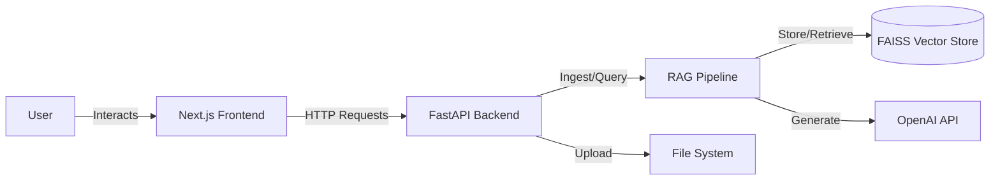

# AI Tutor Project Report

## 1. Executive Summary

This report provides a comprehensive technical overview of the AI Tutor application, a document-querying system designed to allow users to interact intelligently with uploaded PDF documents. The system leverages a cohesive architecture comprising a modern Next.js frontend and a robust FastAPI-based backend. Central to its functionality is a Retrieval-Augmented Generation (RAG) pipeline that enables context-aware responses by retrieving relevant information from a vector database before processing it with a Large Language Model (LLM).

The application is built with scalability and modularity in mind, utilizing industry-standard tools such as LangChain for orchestration, FAISS for vector storage, and OpenAI's suite of models for embeddings and generation. This document details the architectural decisions, component implementations, and the specific data flows that drive the system's core functionalities.

---

## 2. System Architecture Overview

The AI Tutor follows a clean client-server architecture, decoupling the user interface from the logic-heavy backend.

### 2.1 High-Level Diagram

### 2.2 Core Components

*   **Frontend**: Handles user interactions, chat history display, and file uploads. Built with Next.js 16 and React 19, styled with TailwindCSS.
*   **Backend**: Manages API endpoints, handles business logic, and orchestrates the AI operations. Built with FastAPI.
*   **RAG Engine**: Performs document ingestion, text splitting, embedding generation, and semantic search. Powered by LangChain.
*   **Storage**: Uses the local file system for raw PDFs and FAISS (Facebook AI Similarity Search) for storing vector embeddings.

---

## 3. Backend Implementation

The backend is the core intelligence engine of the AI Tutor. It is structured to handle high-concurrency requests and efficient data processing.

### 3.1 Technology Stack

*   **Framework**: **FastAPI** provides a high-performance web server with automatic interactive documentation (Swagger UI).
*   **Server**: **Uvicorn**, an ASGI server implementation, running the application.
*   **Language**: **Python 3.x**.
*   **Orchestration**: **LangChain** is used extensively to manage chains, prompts, and document loading.
*   **PDF Processing**: **PyMuPDF (fitz)** via `langchain_community.document_loaders.PyMuPDFLoader` allows for fast and accurate text extraction from PDFs.

### 3.2 Key Functionality & Tools

#### 3.2.1 API Layer (`src/api/server.py`)
The API exposes three primary endpoints:
1.  **`GET /health`**: A diagnostic endpoint to check if the `TutorAgent` is initialized and ready.
2.  **`POST /chat`**: The main interaction point. It accepts a user message and a session ID. It supports two modes:
    *   **AI Mode**: Uses the full RAG pipeline to generate answers.
    *   **Document-Only Mode**: A fallback or user-selected mode that returns raw search results without LLM synthesis.
    *   *Error Handling*: Includes specific logic to catch OpenAI quota errors ("RESOURCE_EXHAUSTED") and automatically degrade to document-only search.
3.  **`POST /upload`**: Handles PDF file uploads. It validates the file extension, saves it to `data/raw_pdfs`, and immediately triggers an incremental ingestion process to make the document available for querying without restarting the server.

#### 3.2.2 The Agent (`src/agent/tutor.py`)
The `TutorAgent` class acts as the controller. It initializes the RAG pipeline and exposes methods for `ask()` (generating answers) and `search_documents()` (retrieving raw context). It maintains the connection to the retriever and handles the prompt engineering required to guide the LLM.

---

## 4. Implementation Retrieval-Augmented Generation (RAG)

The RAG pipeline is the most critical subsystem, bridging the gap between static documents and dynamic conversational AI.

### 4.1 Embedding Strategy

*   **Model**: **`text-embedding-3-small`**
    *   *Source*: OpenAI.
    *   *Usage*: This model is used to convert both the document chunks and the user's query into high-dimensional vector representations. It offers a balance of cost-efficiency and high performance for semantic similarity tasks.
*   **Configuration**: The model selection is centralized in `src/config/settings.py` to allow for easy upgrades (e.g., to `text-embedding-3-large`) without code changes.

### 4.2 Vector Storage

*   **Tool**: **FAISS (Facebook AI Similarity Search)**
    *   *Library*: `langchain_community.vectorstores.FAISS`.
    *   *Storage Location*: Embeddings are serialized and saved locally to the `data/embeddings/faiss_index` directory.
    *   *Why FAISS?*: It provides extremely fast similarity search for dense vectors and is well-suited for datasets that fit within local memory/disk, avoiding the complexity of a managed service for this scale.

### 4.3 Ingestion Pipeline (`src/ingest.py` & `src/rag/vector_store.py`)

The ingestion process enables the system to "learn" new documents.

1.  **Loading**:
    *   The `PDFLoader` (`src/loaders/pdf_loader.py`) iterates through the `data/raw_pdfs` directory.
    *   It uses **PyMuPDF** to extract text, which is known for its speed and ability to handle complex PDF layouts better than basic loaders.

2.  **Splitting**:
    *   **Tool**: `RecursiveCharacterTextSplitter`.
    *   **Config**: `chunk_size=1000` characters, `chunk_overlap=200` characters.
    *   *Logic*: Large documents are broken down into smaller, manageable chunks. The overlap ensures that context at the edges of chunks is not lost, maintaining semantic continuity.

3.  **Embedding & Indexing**:
    *   The chunks are passed to the `OpenAIEmbeddings` model.
    *   The resulting vectors are added to the FAISS index.
    *   The index is then saved to disk (`save_local`).
    *   *Incremental Updates*: The system supports adding individual files (`ingest_single_file`) without re-processing the entire library, significantly improving performance for uploads.

### 4.4 Retrieval and Generation

When a user asks a question:
1.  **Retrieve**: The user's query is embedded, and FAISS performs a similarity search (`k=8` chunks) to find the most relevant text segments.
2.  **Augment**: These retrieved segments are formatted into a context block.
3.  **Generate**: A prompt containing both the user's question and the retrieved context is sent to the LLM (**`gpt-4o-mini`**). The LLM synthesizes an answer based *only* on the provided context, reducing hallucinations.

---

## 5. Frontend Implementation

The frontend is designed to be responsive, modern, and user-friendly, providing a seamless interface to the complex backend.

### 5.1 Technology Stack

*   **Framework**: **Next.js 16**. Uses the App Router for modern routing and server components.
*   **Library**: **React 19**. Utilization of the latest React features for efficient rendering.
*   **Styling**: **TailwindCSS 4**. Utility-first CSS for rapid and consistent UI development.
*   **Icons**: **Lucide React** for a clean, consistent icon set.
*   **HTTP Client**: **Axios** for robust API communication.

### 5.2 Key Components

*   **Chat Interface**: A dynamic chat window that renders messages. It supports Markdown rendering (via `react-markdown` and `remark-gfm`), enabling the display of rich text, code blocks, and formatted lists in AI responses.
*   **Sidebar**: Displays the list of available/uploaded PDF documents, giving users visibility into the knowledge base.
*   **File Upload**: Integration with the Backend's `/upload` endpoint, allowing users to add knowledge on the fly.
*   **Loading States**: Visual feedback during message generation and file processing to ensure a responsive user experience.

---

## 6. Configuration and Environment

The application relies on environment variables for security and configuration management.

*   **`.env` File**: Stores sensitive keys and operational flags.
    *   `OPENAI_API_KEY`: Required for embeddings and chat generation.
*   **`src/config/settings.py`**: A centralized configuration module that loads environment variables and applies defaults. It defines paths for data directories (`data/raw_pdfs`, `data/embeddings`) and model identifiers, ensuring that hardcoded values are minimized across the codebase.

## 7. Conclusion

The AI Tutor project successfully integrates state-of-the-art NLP technologies into a practical, usable application. By combining the speed of FAISS, the accuracy of OpenAI's embeddings, and the flexibility of LangChain, it delivers a powerful tool for document interrogation. The clear separation of concerns between the frontend and backend ensures that the system is maintainable and ready for future enhancements, such as switching vector stores or upgrading LLM models.